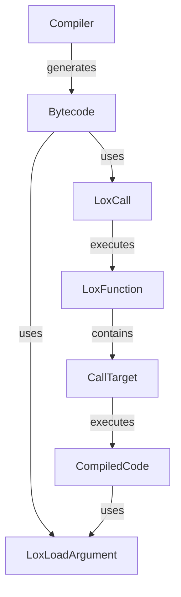

Okay, let's try to break down what the user is asking. They mentioned they don't understand LoxLoadArgument, LoxFunction, visitCall, and LoxCall in the provided code. Let me start by recalling the context. The code is part of a Truffle-based implementation of the Lox language compiler and runtime. The user is struggling with how these components interact, especially related to function arguments and calls.

First, I need to remember how function calls work in a compiler. When a function is called, arguments are passed and need to be loaded into the function's scope. In the code, LoxLoadArgument is an operation that handles loading arguments from the call frame. The @Operation annotation suggests it's part of the Truffle DSL for defining operations. The constant operand of type int.class indicates it's loading an argument by index.

Then there's LoxFunction, which is a runtime object representing a function. It holds the call target (the compiled code) and the outer frame for closures. The createArguments method probably prepares the arguments array, including the function itself as the first element, which might be for handling closures or the 'this' context.

Looking at visitCall in the compiler, it's responsible for generating bytecode for function calls. The code starts with beginLoxCall for each call, visits the primary expression (the function to call), then processes each argument by visiting their expressions. After loading all arguments, it emits endLoxCall to invoke the function.

LoxCall is the operation that executes the function call. It uses Specialization for direct and indirect calls. Direct calls are optimized when the function's call target is known, using a cached DirectCallNode. Indirect calls use an IndirectCallNode for cases where the target isn't known at compile time, like dynamic function references.

Putting this together: when a function is called, the compiler (visitCall) generates code to push each argument onto the stack (using LoxLoadArgument if they're parameters), then invokes LoxCall to execute the function. LoxFunction wraps the executable code and context, while LoxLoadArgument handles retrieving parameters from the call frame.

The user might be confused about how these pieces interact during a function call. Maybe they're not clear on how arguments are passed from the caller to the callee, or how the function object is structured. Let me explain each component step by step, relate them to the function call process, and provide examples to illustrate the flow

Let me break down these key components related to function arguments and calls in the Lox implementation:

### 1. **LoxLoadArgument (Argument Handling)**

```java
@Operation
@ConstantOperand(type = int.class)
public static final class LoxLoadArgument {
    @Specialization(guards = "index <= arguments.length")
    static Object doDefault(VirtualFrame frame, int index,
            @Bind("frame.getArguments()") Object[] arguments) {
        return arguments[index + 1];
    }

    @Fallback
    static Object doLoadOutOfBounds(int index) {
        return Nil.INSTANCE;
    }
}
```

**What it does:**

- Loads function arguments from the call frame
- `index + 1` skips the first argument (which is the function object itself)
- Used when accessing parameters inside function bodies

**Example:**

```javascript
fun add(a, b) {
    return a + b; // a is argument[0], b is argument[1]
}
```

### 2. **LoxFunction (Function Representation)**

```java
public class LoxFunction {
    private final String name;
    private final RootCallTarget callTarget;
    private final MaterializedFrame outerFrame;

    public Object[] createArguments(Object[] userArguments) {
        Object[] result = new Object[userArguments.length + 1];
        result[0] = this; // First argument is the function itself
        System.arraycopy(userArguments, 0, result, 1, userArguments.length);
        return result;
    }
}
```

**Key Points:**

- Represents a function at runtime
- `callTarget`: The executable code for the function
- `outerFrame`: Captured closure environment
- `createArguments()` prepares arguments array with function self-reference

### 3. **visitCall (Compiler Handling)**

```java
@Override
public Void visitCall(CallContext ctx) {
    // For each call in chain (foo()()())
    for (int i = 0; i < calls.size(); i++) {
        b.beginLoxCall();
    }

    // Visit the function/method being called
    visit(ctx.primary());

    // Process arguments for each call
    for (CallArgumentsContext callArgs : calls) {
        // Compile arguments
        if (callArgs.arguments() != null) {
            for (ExpressionContext arg : callArgs.arguments().expression()) {
                visit(arg);
            }
        }
        // Emit CALL operation
        b.endLoxCall();
    }
    return null;
}
```

**Compilation Process:**

1. Start call operation(s)
2. Compile the call target (function/method)
3. Compile arguments
4. Emit call instruction

### 4. **LoxCall (Execution Logic)**

```java
@Operation
public static final class LoxCall {
    @Specialization(guards = "function.getCallTarget() == cachedTarget")
    static Object doDirect(LoxFunction function, Object[] arguments,
            @Cached("function.getCallTarget()") RootCallTarget cachedTarget,
            @Cached("create(cachedTarget)") DirectCallNode directCallNode) {
        return directCallNode.call(function.createArguments(arguments));
    }

    @Specialization(replaces = "doDirect")
    static Object doIndirect(LoxFunction function, Object[] arguments,
            @Cached IndirectCallNode callNode) {
        return callNode.call(function.getCallTarget(), function.createArguments(arguments));
    }
}
```

**Key Mechanics:**

- **DirectCallNode:** Used when function target is known (optimized path)
- **IndirectCallNode:** Used for dynamic/unknown function targets
- Both specializations handle the actual function invocation

### Flow of Function Calls

1. **Compilation Phase** (`visitCall`):

   ```javascript
   foo(1, 2);
   ```

   - Compiles to:
     ```
     LOAD foo
     LOAD 1
     LOAD 2
     CALL 2
     ```

2. **Runtime Phase** (`LoxCall`):

   ```java
   // Inside LoxCall.doDirect()
   Object[] args = {fooFunction, 1, 2};
   directCallNode.call(args);
   ```

3. **Argument Access** (`LoxLoadArgument`):
   ```javascript
   fun foo(a, b) {
       print a; // Uses LoxLoadArgument[0]
   }
   ```

### Key Relationships



This system enables efficient function calls while supporting features like:

- First-class functions
- Closures (through outerFrame)
- Both static and dynamic dispatch
- Variable argument handling

Would you like me to elaborate on any specific aspect of this mechanism?

Okay, let's try to figure out how the variables a and b get assigned to 3 and 4 when the function print is called. The user provided a bunch of code snippets, mostly related to the Truffle framework for building languages. Let me walk through the code step by step.

First, looking at the visitFunDecl method. When a function is declared, like print(a, b), the code processes the parameters. The parameters are obtained via enterFunction(function), which returns a list of TerminalNodes (probably the parameter identifiers). Then, for each parameter, it's added to the current scope with curScope.define(paramName, ctx). Then, there's some bytecode emission happening: emitLoxLoadArgument(i) which probably loads the i-th argument. Then it stores that into the current scope with beginStore and endStore. So, this part seems to be responsible for taking the arguments passed to the function and storing them into the local variables (like a and b).

Now, looking at the LoxLoadArgument operation. This is an operation that's supposed to load an argument from the frame. The doDefault method takes the frame's arguments, and returns the one at index + 1. Wait, why index +1? Oh, maybe because the first argument in the frame is the function itself. Because in the LoxFunction's createArguments method, they prepend the function instance to the user arguments. So when the function is called, the actual arguments start from index 1 in the frame's arguments array.

So when the function is called, the parameters a and b are loaded using LoxLoadArgument with indices 0 and 1. But since the frame's arguments[0] is the function itself, the user arguments start at 1. Therefore, LoxLoadArgument for index 0 would get arguments[0 +1] = arguments[1], which is the first user argument. Similarly for index 1, it gets arguments[2], the second user argument. That makes sense.

Then, in visitFunDecl, after processing the parameters, the code emits a store operation into the current scope. So each parameter is stored as a local variable in the function's scope. So when the function is called, the arguments are loaded from the frame (with indices adjusted) and stored into the local variables a and b.

When the user calls print(3,4), during the call, the arguments 3 and 4 are passed. The LoxCall operations handle the call. The LoxFunction's createArguments method adds the function itself as the first argument (result[0] = this), then copies the user arguments starting from index 1. So the frame's arguments array for the function will be [thisFunction, 3,4].

When the function starts executing, the parameters a and b are loaded by LoxLoadArgument with indices 0 and 1. For index 0, that's frame arguments[1] which is 3, and index 1 is frame arguments[2] which is 4. These values are then stored into the local variables a and b via the curScope.define and the store operations.

So the part that assigns a=3 and b=4 is in the visitFunDecl where they loop over the parameters, load each argument from the frame (adjusted for the function being the first argument), and store them into the current scope as variables. The LoxLoadArgument operation handles loading from the correct position in the frame's arguments array, which was set up when the function was called via LoxCall and createArguments.

The assignment of parameters like a = 3 and b = 4 happens in two key parts of your code:

1. Parameter Storage During Function Declaration
   When the function print(a, b) is declared, the code in visitFunDecl does this:

java
Copy
// For each parameter (e.g., "a" and "b"):
for (int i = 0; i < parameters.size(); i++) {
var param = parameters.get(i);
var paramName = param.getText();

    // Define the parameter as a local variable in the current scope
    curScope.define(paramName, ctx);

    // Store the argument value into the variable
    curScope.beginStore(paramName);
    b.emitLoxLoadArgument(i); // Loads the i-th argument (from the call)
    curScope.endStore();

}
emitLoxLoadArgument(i) generates code to load the i-th argument passed to the function.

curScope.beginStore(paramName) and curScope.endStore() store the loaded argument value into the local variable (a or b).

2. Argument Loading During Function Calls
   When you call print(3, 4), the arguments 3 and 4 are prepared by:

A. LoxFunction.createArguments(...)
java
Copy
public Object[] createArguments(Object[] userArguments) {
Object[] result = new Object[userArguments.length + 1];
result[0] = this; // Function itself is first argument
System.arraycopy(userArguments, 0, result, 1, userArguments.length); // User args follow
return result;
}
This creates an argument array like: [LoxFunction (print), 3, 4].

B. LoxLoadArgument Operation
java
Copy
@Specialization(guards = "index <= arguments.length")
static Object doDefault(VirtualFrame frame, int index,
@Bind("frame.getArguments()") Object[] arguments) {
return arguments[index + 1]; // Skip the first element (the function)
}
When emitLoxLoadArgument(0) is called (for parameter a), it accesses arguments[0 + 1] = arguments[1] = 3.

When emitLoxLoadArgument(1) is called (for parameter b), it accesses arguments[1 + 1] = arguments[2] = 4.

Key Flow for print(3, 4):
Call Preparation: LoxCall passes [print, 3, 4] as the frame arguments.

Function Execution: The code generated in visitFunDecl loads arguments[1] (3) into a, and arguments[2] (4) into b via LoxLoadArgument.

Scope Storage: The loaded values are stored as local variables in the function's scope.

The part that defines and assigns local variables a = 3 and b = 4 in fun print(a, b) { print a + b; } happens during function execution when the function call arguments are bound to function parameters. Let’s break it down step by step:

1. Function Definition
   When you declare a function, visitFunDecl(FunDeclContext ctx) is responsible for processing the function declaration. This method:

Extracts the function name and parameters.
Defines them in the current scope (curScope.define(paramName, ctx);).
Emits bytecode for loading function arguments (b.emitLoxLoadArgument(i);).
Stores them in the function’s scope (curScope.beginStore(paramName); ... curScope.endStore();). 2. Function Call Execution
When print(3,4) is executed:

visitCall(CallContext ctx) is invoked, which:

Visits the function reference.
Visits the call arguments (expressions 3 and 4).
Calls b.endLoxCall();, emitting bytecode for function invocation.
The function LoxCall executes:

The specialization method doDirect() or doIndirect() selects the appropriate call method.
createArguments(Object[] userArguments) is called, which:
Creates a new array where the function instance itself is stored at index 0.
Copies the user-supplied arguments (3, 4) into subsequent positions. 3. Retrieving Arguments Inside the Function
The function body accesses parameters using LoxLoadArgument.doDefault(), which:
Extracts arguments from frame.getArguments().
Uses index + 1 to skip the function reference at index 0.
Thus, when the function body executes:

java
Copy
Edit
b.emitLoxLoadArgument(i);
curScope.endStore();
each parameter (a and b) is stored as a local variable. This means a is retrieved using getArgument(frame, 0), which corresponds to 3, and b using getArgument(frame, 1), which corresponds to 4.

This ensures that within the function, a = 3 and b = 4.
